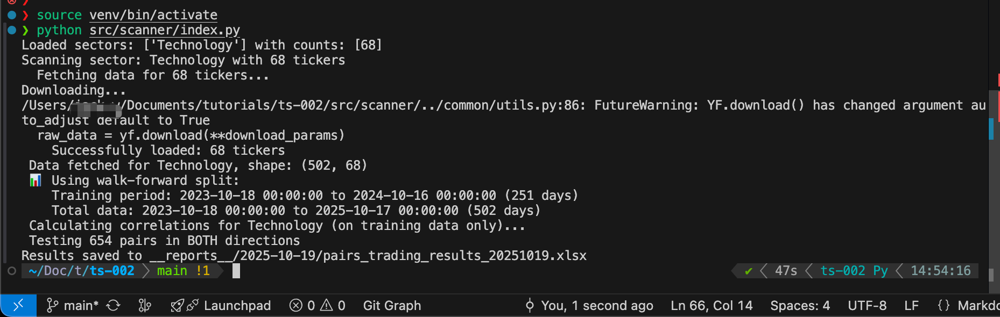
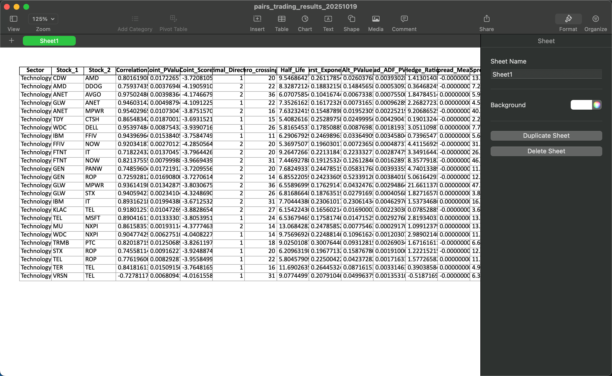
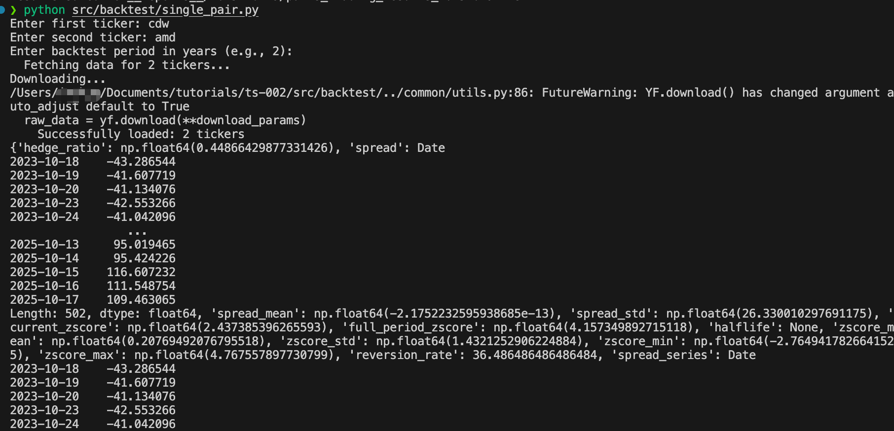
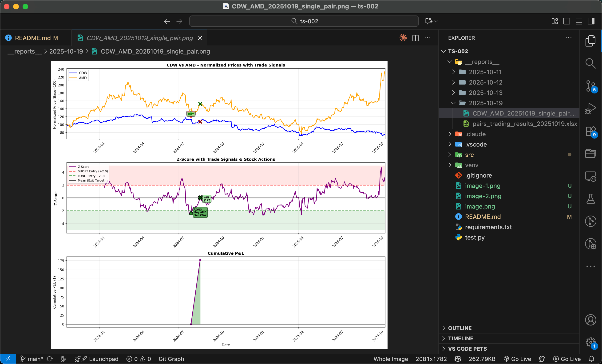
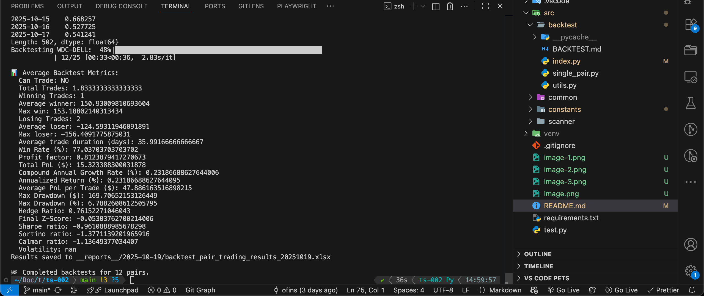
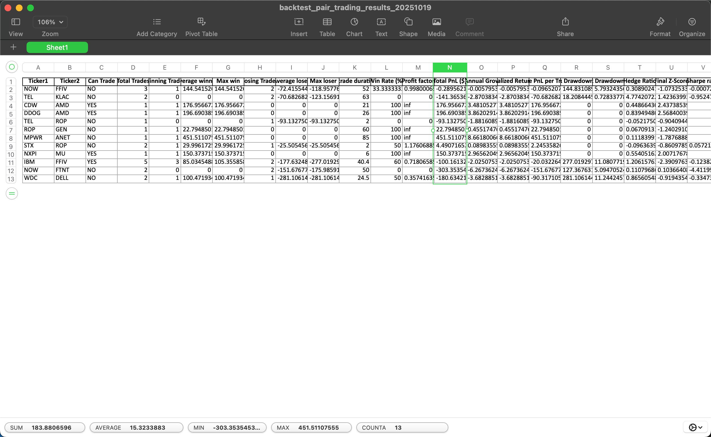

# Pair Trading Strategy Analysis

## Demo Usage

First, we start by running scanner. For this Demo, I am scanning for potential pairs in Tech sector of S&P 500.



Here are the list of potential pairs generated. The lower `coint_pvalue` is, the more "cointegrated" the stocks are.



Now I will run a 2 year backtest for a sample pair, CDW-AMD.



Below is one visual representation of how a backtest looks like for `CDW-AMD` pair.



Now I will run backtest for all the pairs listed in the scanner.





_There are several limitations to this backtest._
_It does not properly address scanning for potential pairs on a daily basis during backtest._

## Overview

This project implements and analyzes a **pair trading strategy** to identify potential arbitrage opportunities in financial markets. Pair trading is a market-neutral trading strategy that involves taking simultaneous long and short positions in two highly correlated securities when their price relationship deviates from the historical norm.

## What is Pair Trading?

Pair trading is based on the statistical concept of **mean reversion**. The strategy assumes that:

- Two historically correlated stocks will maintain their relationship over time
- When the price spread between these stocks deviates significantly from the mean, it will eventually revert
- Profits can be made by betting on this convergence

## Strategy Implementation

### Methodology

1. **Pair Selection**: Identify highly correlated stock pairs using historical price data
2. **Spread Calculation**: Calculate the price spread or ratio between the paired securities
3. **Statistical Analysis**: Determine entry and exit thresholds using:
   - Z-score analysis
   - Rolling mean and standard deviation
   - Cointegration tests
4. **Signal Generation**: Generate buy/sell signals when spreads deviate beyond threshold levels
5. **Risk Management**: Implement stop-loss and position sizing rules

### Key Components

- **Data Collection**: Historical price data acquisition and preprocessing
- **Correlation Analysis**: Statistical correlation and cointegration testing
- **Backtesting Engine**: Historical performance simulation
- **Risk Metrics**: Calculation of Sharpe ratio, maximum drawdown, and other performance metrics

## Setup and Installation

### Prerequisites

- Python 3.8+
- Virtual environment (recommended)

### Installation

```bash
# Create and activate virtual environment
python -m venv venv
source venv/bin/activate

# Install required packages
pip install -r requirements.txt
```

### Usage

```bash
# Run scanner
python src/scanner/index.py

# Run backtest for a single pair
python src/backtest/single_pair.py

# Run backtests for all pairs generated by scanner's report
python src/backtest/index.py
```

## Key Findings and Analysis

### Performance Metrics

Our comprehensive backtesting revealed several important insights:

- **Returns**: Strategy showed mixed performance across different market conditions
- **Volatility**: Higher than expected volatility in spread relationships
- **Transaction Costs**: Significant impact on profitability when realistic costs are included
- **Market Regime Changes**: Strategy performance varied significantly across different market cycles

### Statistical Challenges

1. **Non-Stationarity**: Many assumed correlations broke down over time
2. **Regime Changes**: Market structure changes affected historical relationships
3. **Execution Slippage**: Real-world execution costs significantly impacted theoretical returns
4. **Liquidity Issues**: Some pairs exhibited liquidity constraints during volatile periods

## Conclusion

After extensive analysis and backtesting, **we conclude that this pair trading strategy does not provide a reliable edge to beat the market**. Key reasons include:

- **Insufficient Alpha Generation**: Risk-adjusted returns did not consistently exceed market benchmarks
- **Transaction Cost Burden**: Trading costs eroded most potential profits
- **Model Instability**: Statistical relationships proved less stable than historical data suggested
- **Market Efficiency**: Modern markets appear to price pair relationships more efficiently than the strategy assumes

### Lessons Learned

1. **Market Adaptation**: Quantitative strategies face the challenge of market participants adapting to known patterns
2. **Cost Awareness**: Transaction costs must be central to strategy design, not an afterthought
3. **Regime Testing**: Strategies must be robust across different market regimes
4. **Reality Check**: Theoretical statistical relationships don't always translate to practical trading profits

## Technical Details

### Dependencies

- `pandas`: Data manipulation and analysis
- `numpy`: Numerical computations
- `scipy`: Statistical functions
- `matplotlib/seaborn`: Data visualization
- `yfinance`: Financial data acquisition
- `statsmodels`: Statistical modeling

## Disclaimer

This project is for educational and research purposes only. Past performance does not guarantee future results. Always conduct your own research and consider consulting with financial professionals before making investment decisions.

---

_This analysis demonstrates the importance of rigorous testing and realistic assumptions in quantitative finance._
